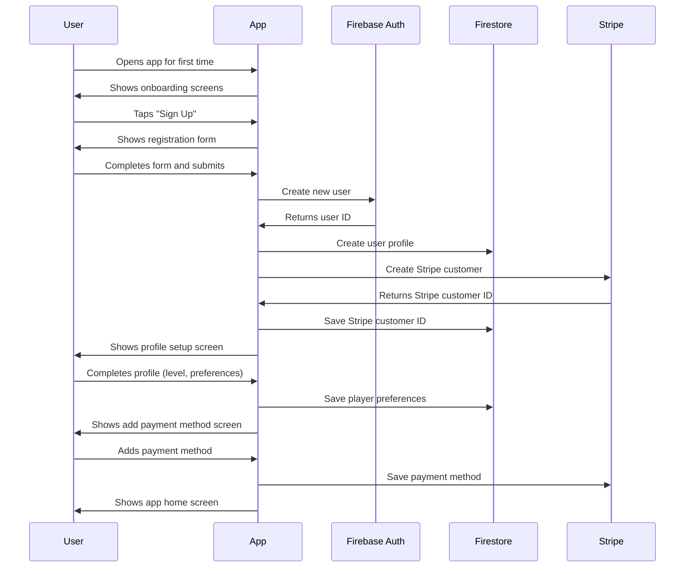
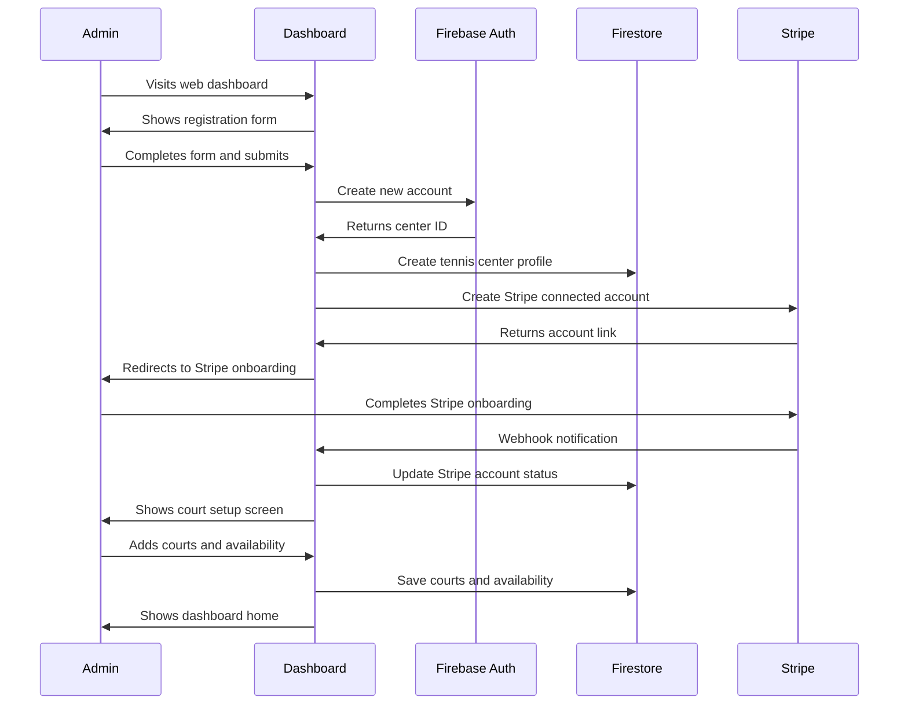
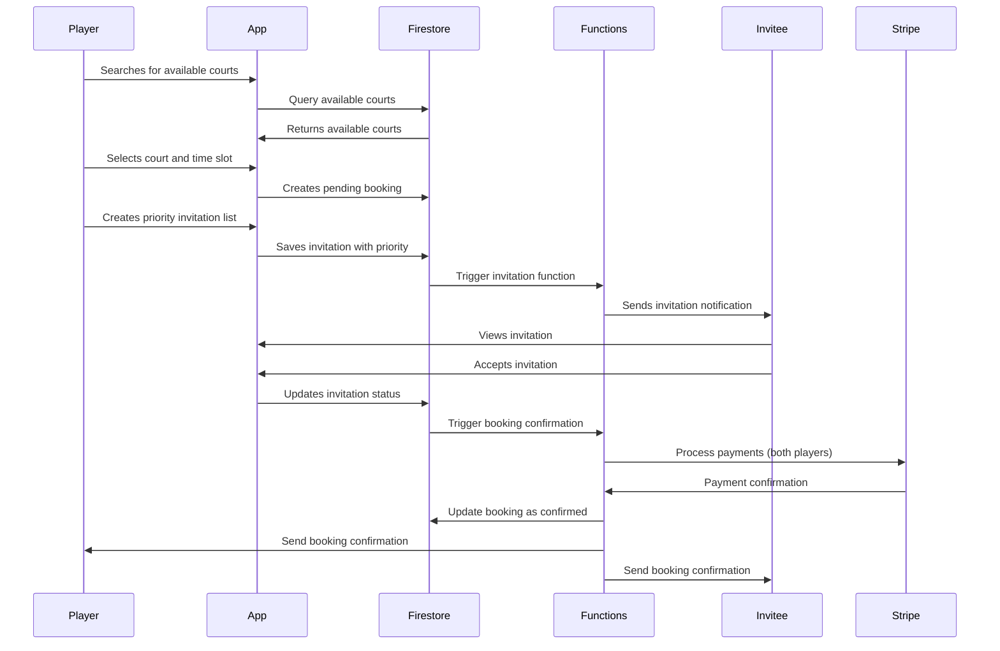
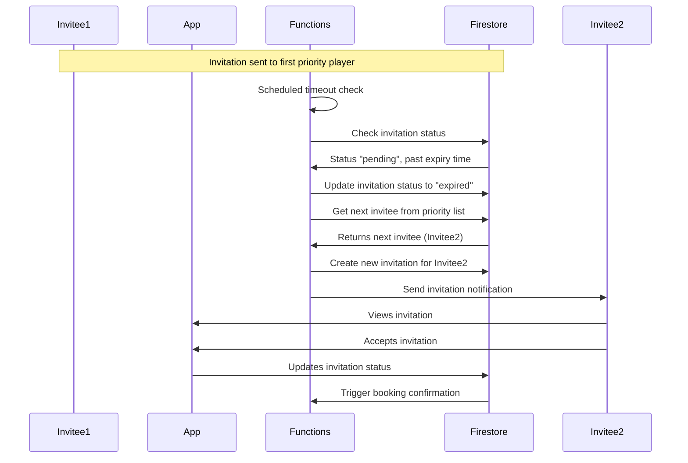
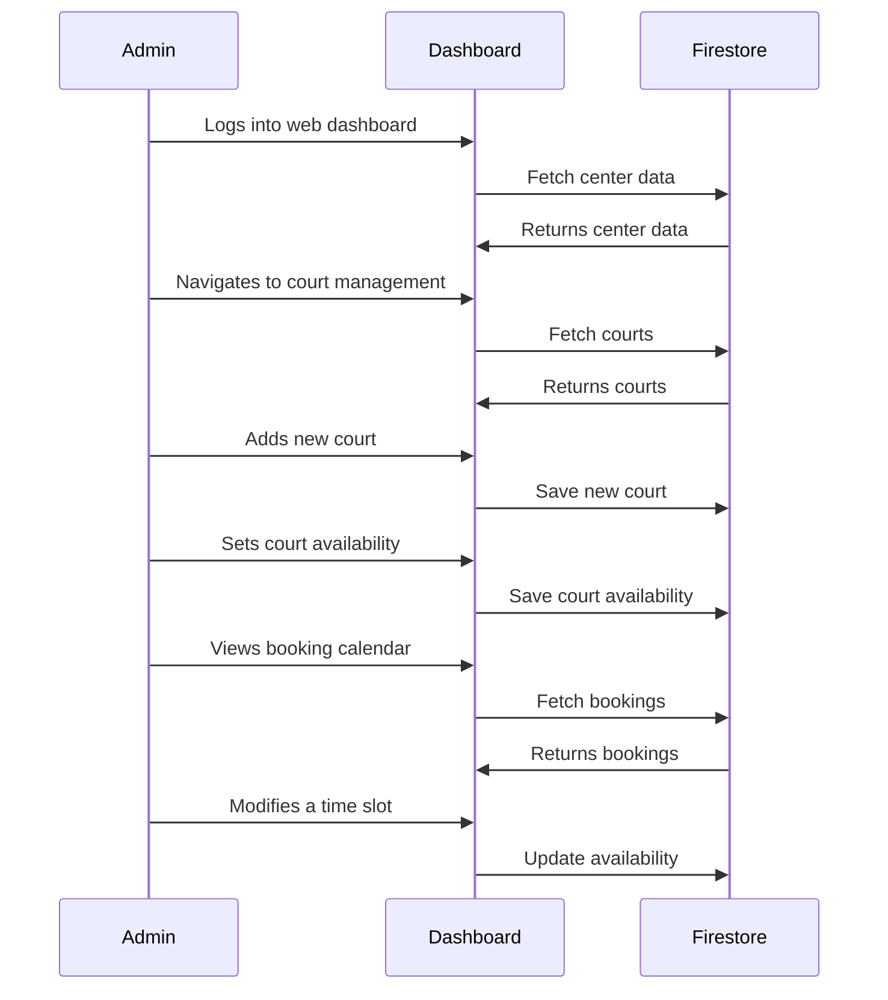
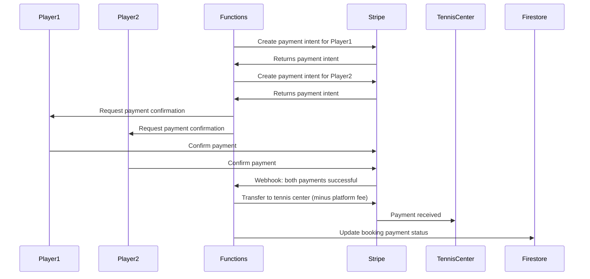
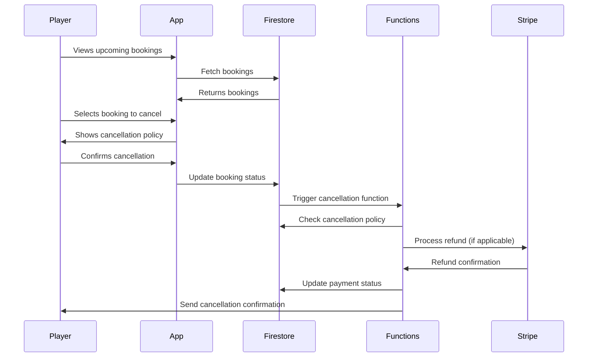
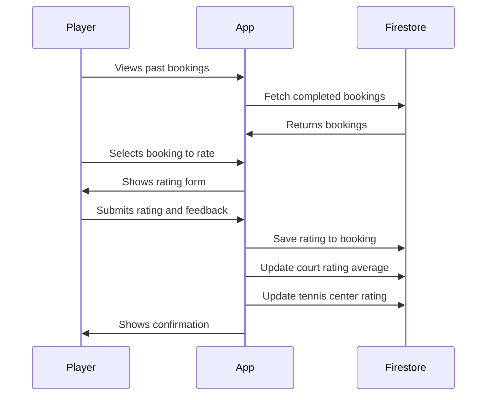
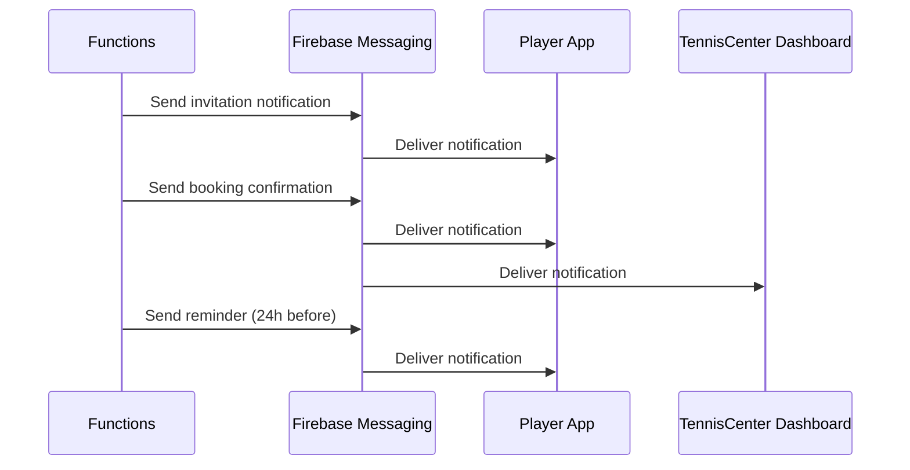
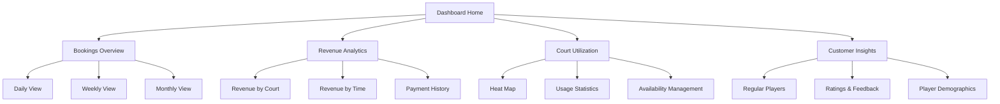

# Oval: Key Workflows

This document describes the core workflows and user journeys in the Oval.

## 1. Player Registration Process

## 2. Tennis Center Registration Process

## 3. Court Booking and Invitation Flow

## 4. Invitation Timeout and Cascade Flow

## 5. Tennis Center Court Management Flow

## 6. Payment Processing Flow

## 7. Booking Cancellation Flow

## 8. User Feedback and Rating Flow

## 9. Notification System

## 10. Tennis Center Analytics Dashboard

